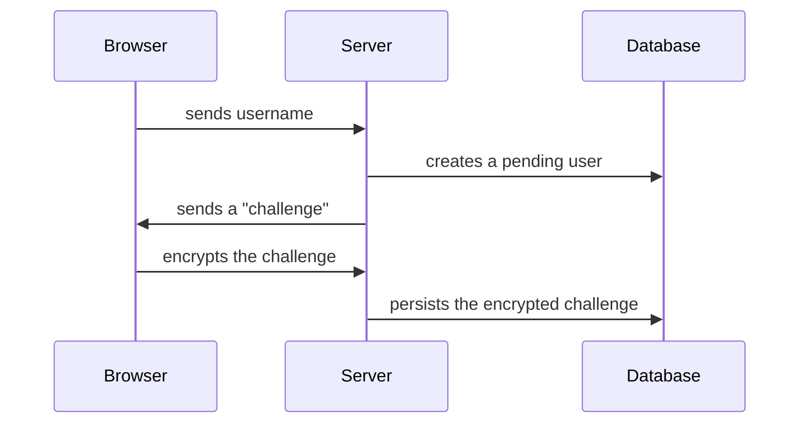
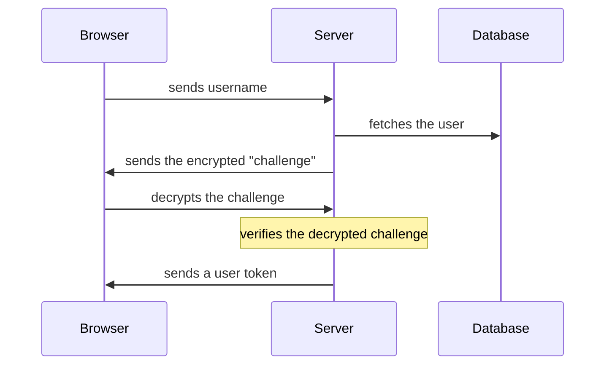

# Capsulen

Capsulen is a compact journaling application inspired by microblogs. It encrypts all your data in the browser before
persisting it on the server, ensuring that only the individual with the private key can access the contents of the
journal.

## How it works?

The underlying concept is to eliminate any possibility of linking an account to a specific identity, and passwords
should not be transmitted over the wire. Here's how we handle creating a user and a user token:

### Creating a user



### Creating a user token



- User tokens are only stored in memory (there are no persistent sessions)
- To create a user, you must obtain an invite code from an existing user

## Running locally

Ensure you have a PostgreSQL database created and running. Next, copy the `.env.example` as `.env`, replacing the
values (PASETO key and Sentry ones are not required). Then run the following commands:

```shell
npm install
npm run db:refresh
```

To create an initial account, generate an invite code:

```shell
npm run gen:invite
```

You don't need to inform a `PASETO_KEY`. In that case, every time the app restarts, it will generate a new key. If you
want to have a single key for all restarts, generate one and paste it into your `.env` with the following command:

```shell
npm run gen:pasetoKey
```

To run the application in development mode, execute:

```shell
npm run dev
```

## Running in production

Build the assets and start the server:

```shell
npm run build
npm run start
```
